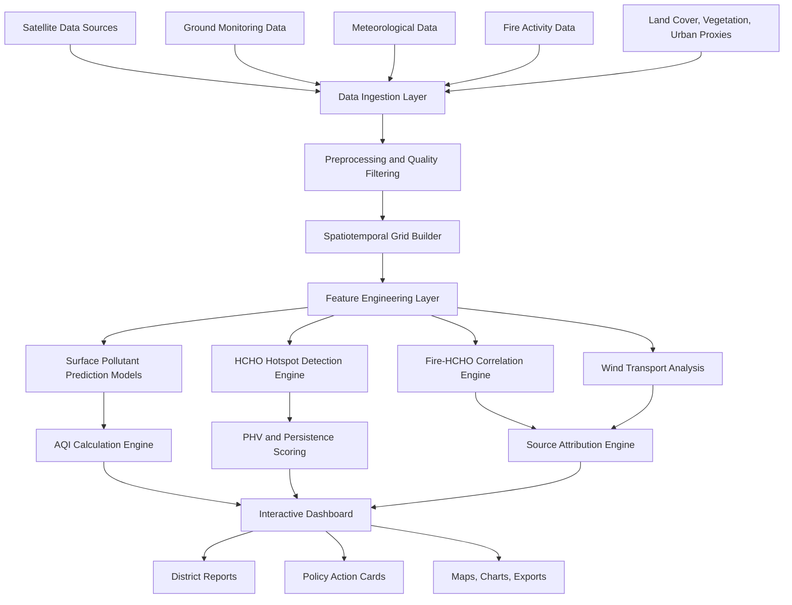
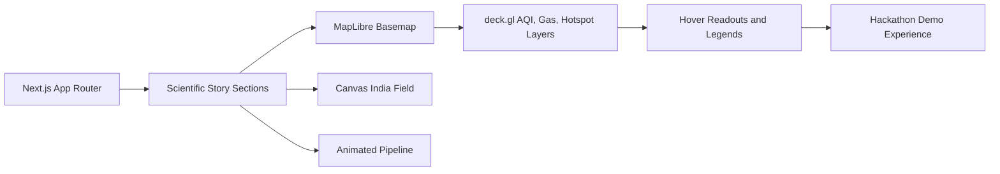

# VAYU - BharatAir Sentinel

### Satellite-Based Surface AQI & HCHO Hotspot Intelligence System for India


**VAYU transforms satellite observations, ground monitoring, meteorology, and fire activity data into explainable AQI maps and HCHO/VOC hotspot intelligence for India.**

This repository contains an interactive web prototype for **Bharatiya Antariksh Hackathon 2026 - Challenge 03: Development of Surface AQI & Identification of HCHO Hotspots over India using Satellite Data**.

The project is designed as a decision-support platform, not just a pollution dashboard. It explains where pollution is forming, which pollutant is dominant, where HCHO/VOC hotspots are emerging, whether biomass burning and wind transport are involved, how confident the system is, and what actions authorities can prioritize.

> Current prototype note: the deployed web experience uses sample geospatial layers in `public/data/` to demonstrate the product, workflow, maps, and storytelling interface. The architecture is validation-ready and designed to be connected to operational satellite, CPCB, meteorological, and fire datasets.

---

## Problem Statement

Air pollution is one of India's most serious environmental and public health challenges. Ground-based air quality monitors provide high-quality measurements, but their spatial coverage is limited. Rural, semi-urban, agricultural, forest-fire, mining, port, and industrial regions can remain under-observed even when pollution exposure is high.

Satellite observations help close this gap by providing spatially continuous information about aerosols and trace gases. For India, this is especially relevant to:

- **NCAP**: India's National Clean Air Programme for reducing air pollution in non-attainment cities.
- **SDG 11.6**: reducing the adverse environmental impact of cities, including air quality.
- **Biomass burning seasons**: crop residue burning and forest fires can elevate aerosols, VOCs, and HCHO.
- **Ozone chemistry**: HCHO is a useful proxy for VOC activity and a key precursor signal for ozone formation.

The challenge has two core objectives:

| Objective | Goal |
| --- | --- |
| **Surface AQI Mapping** | Estimate spatial surface AQI over India by fusing satellite columns, AOD, CPCB observations, meteorology, and land-context features. |
| **HCHO Hotspot Detection** | Identify high-resolution HCHO/VOC hotspots, test biomass-burning influence, analyze transport, and classify likely source types. |

---

## Solution Overview

VAYU is organized around five intelligence layers:

| Layer | What It Does |
| --- | --- |
| **1. Satellite-driven AQI mapping** | Converts remotely sensed aerosol and trace-gas signals into a spatial AQI field. |
| **2. Pollutant-wise concentration modeling** | Predicts PM2.5, PM10, NO2, SO2, CO, and O3 before computing AQI. |
| **3. HCHO hotspot intelligence** | Detects HCHO anomalies using thresholding, PHV, clustering, and persistence scoring. |
| **4. Fire and transport attribution** | Links hotspots to MODIS/VIIRS fire detections and ERA5/IMDAA wind fields. |
| **5. Decision dashboard** | Presents district-level maps, source labels, confidence, and policy action cards. |

---

## What Is Implemented

This repository currently focuses on the **interactive front-end prototype** for judges, mentors, and reviewers.

| Module | Current Status | Evidence in Repo |
| --- | --- | --- |
| Interactive landing and story flow | Implemented | `app/page.tsx`, `components/Hero.tsx`, `components/sections.tsx` |
| AQI map visualization | Implemented with sample frames | `components/DeckMap.tsx`, `public/data/aqi_frames.json` |
| Sentinel-style pollutant layer switching | Implemented with sample gas grids | `public/data/gas_grids.json` |
| HCHO hotspot explorer | Implemented with sample hotspot layer | `public/data/hcho_grid.json`, `public/data/hotspots.json` |
| Fire overlay and transport path | Implemented with sample fire and trajectory data | `public/data/fires.json`, `public/data/trajectory.json` |
| Scientific product narrative | Implemented | `components/sections.tsx` |
| Production ingestion and ML backend | Planned | See roadmap below |

---

## Key Features

| Feature | Description | Status |
| --- | --- | --- |
| Surface AQI map | Spatial AQI visualization over India using CPCB color classes. | Prototype |
| Pollutant-wise spatial layers | AOD, NO2, SO2, CO, O3, and HCHO visual layers. | Prototype |
| CPCB validation concept | Station-based validation workflow for predicted pollutants. | Designed |
| Sentinel-5P pollutant ingestion | Planned ingestion for TROPOMI NO2, SO2, CO, O3, and HCHO. | Planned |
| INSAT-3D AOD ingestion | Planned aerosol signal for PM2.5 estimation. | Planned |
| ERA5 / IMDAA meteorology fusion | Wind, boundary-layer, humidity, temperature, and transport features. | Planned |
| HCHO concentration mapping | Spatial HCHO layer for VOC precursor intelligence. | Prototype |
| PHV-based HCHO anomaly detection | Local anomaly scoring against neighboring HCHO pixels. | Designed |
| MODIS / VIIRS fire overlay | Fire count and FRP context for biomass burning. | Prototype |
| Fire-HCHO lag correlation | Lag 0 to lag 3 analysis for fire-linked HCHO response. | Planned |
| Wind-assisted transport analysis | Upwind fire detection and downwind hotspot hypothesis. | Prototype |
| Source attribution engine | Fire-linked, biogenic, urban-industrial, port/shipping, transported plume, mixed, uncertain. | Designed |
| Hotspot persistence score | Ranks repeated HCHO hotspots across daily/weekly windows. | Planned |
| Composite Multi-Pollutant Risk Score | Captures combined pollutant burden beyond max-subindex AQI. | Designed |
| District-level hotspot reports | District summaries for decision makers. | Planned |
| Interactive dashboard | Map-first exploratory interface for AQI and HCHO intelligence. | Prototype |
| CNN-LSTM / ConvLSTM modeling | Spatiotemporal pollutant modeling architecture. | Planned |
| SHAP explainability | Feature attribution for model-estimated pollution. | Planned |
| 24-72 hour forecasting | Short-horizon AQI and HCHO risk outlook. | Future |
| PDF reports and API service | Exportable reports and external access endpoints. | Future |

---

## System Architecture



### HCHO Hotspot Workflow


### Current Web Prototype Flow



---

## Data Sources

| Dataset | Source | Purpose |
| --- | --- | --- |
| INSAT-3D AOD | MOSDAC | Aerosol signal for PM2.5 estimation |
| Sentinel-5P HCHO | Google Earth Engine / DLR | HCHO hotspot and VOC precursor detection |
| Sentinel-5P NO2 | Google Earth Engine | NO2 surface estimation and ozone precursor context |
| Sentinel-5P SO2 | Google Earth Engine | Industrial and combustion source signal |
| Sentinel-5P CO | Google Earth Engine | Combustion and transport indicator |
| Sentinel-5P O3 | Google Earth Engine | Ozone context |
| CPCB CAAQMS | CPCB | Ground-truth pollutant observations |
| ERA5 / IMDAA / MERRA-2 | Copernicus / NCMRWF / NASA | Meteorology, wind, humidity, temperature, and boundary-layer variables |
| MODIS / VIIRS Fire | NASA FIRMS | Biomass burning and fire activity |
| NDVI / EVI | MODIS / Sentinel | Biogenic VOC and vegetation signals |
| Land Cover | ESA WorldCover / MODIS | Urban, crop, forest, water, and industrial context |
| Night Lights | VIIRS | Urbanization and anthropogenic activity proxy |
| Elevation | SRTM / DEM | Terrain and dispersion context |
| Roads / POI | OpenStreetMap | Traffic and source proxy |

---

## Methodology

### 1. Data Ingestion

The production system is designed to ingest satellite, ground, fire, vegetation, meteorological, and land-context data into a common geospatial pipeline:

- Sentinel-5P TROPOMI HCHO, NO2, SO2, CO, and O3 columns.
- INSAT-3D AOD for aerosol context and PM2.5 estimation.
- CPCB CAAQMS station observations for supervised learning and validation.
- ERA5 / IMDAA / MERRA-2 meteorology for transport, dispersion, and surface conversion.
- MODIS / VIIRS fire detections for biomass burning attribution.
- NDVI / EVI, land cover, night lights, roads, elevation, and population features.

### 2. Preprocessing

The preprocessing layer standardizes all observations into a clean spatiotemporal grid:

- QA and cloud filtering.
- Unit harmonization.
- India and pilot-region clipping.
- Reprojection and resampling.
- Daily, weekly, and seasonal aggregation.
- Missing value handling and outlier filtering.
- Spatial join between CPCB stations and satellite pixels.
- Feature table generation for model training and inference.

### 3. Surface Pollutant Prediction

The system follows a **pollutant-first AQI modeling** approach. It predicts surface pollutant concentrations first, then computes AQI from pollutant sub-indices.

Supported pollutants:

- PM2.5
- PM10
- NO2
- SO2
- CO
- O3

Baseline model candidates:

- Random Forest
- XGBoost
- LightGBM
- CatBoost

Advanced model candidates:

- CNN-LSTM
- ConvLSTM
- Graph Neural Networks
- Ensemble learning

This avoids treating AQI as a black-box target and keeps the output scientifically interpretable.

### 4. AQI Calculation

For each grid cell, the platform computes:

- Pollutant-wise surface concentration.
- Pollutant-wise AQI sub-index.
- Final AQI category.
- Dominant pollutant.
- Secondary pollutant.
- Model confidence score.
- Uncertainty score.

### 5. HCHO Hotspot Detection

HCHO is used as a proxy for VOC activity and ozone precursor potential. The hotspot engine combines concentration mapping with local anomaly logic.

```text
PHV = ((HCHO_pixel - HCHO_neighborhood_mean) / HCHO_neighborhood_mean) x 100
```

PHV, or **Percentage Higher than Vicinity**, helps avoid labeling naturally high background regions as hotspots. A cell is more meaningful when it is high relative to nearby cells, persistent over time, and supported by source evidence.

Hotspot methods:

- Percentile thresholding.
- PHV local anomaly scoring.
- DBSCAN / HDBSCAN clustering.
- Persistence scoring.
- Hotspot ranking.

### 6. Fire-HCHO Lag Correlation

The fire-correlation engine tests whether HCHO enhancements are temporally linked to nearby biomass burning.

Planned analysis:

- Fire count buffers at 25 km, 50 km, and 100 km.
- Same-day correlation.
- Lag 1, lag 2, and lag 3 analysis.
- Fire radiative power context.
- Seasonal comparison for crop residue burning and forest fire windows.

### 7. Wind-Assisted Transport Analysis

Pollution does not stay at its source. The transport layer uses wind fields to test whether a hotspot could be influenced by upwind fires or industrial areas.

Core logic:

- Extract wind speed and direction from ERA5 / IMDAA.
- Identify upwind fire clusters.
- Detect downwind HCHO response zones.
- Estimate transported plume probability.
- Flag uncertain cases where meteorology does not support transport.

### 8. Source Attribution

The MVP source attribution engine can begin as a rule-based classifier and evolve into a supervised or weakly supervised ML model.

Source classes:

- Fire-linked
- Biogenic
- Urban-industrial
- Port/shipping
- Transported plume
- Mixed
- Uncertain

Each hotspot card should include evidence, confidence, and suggested next action.

### 9. Composite Multi-Pollutant Risk Score

Traditional AQI is usually driven by the maximum pollutant sub-index. That is useful for public communication, but it can understate cases where several pollutants are moderately elevated at the same time.

VAYU adds a **Composite Multi-Pollutant Risk Score** as an innovation layer. This score is intended to capture combined burden across pollutants while still preserving the official AQI output.

### 10. Dashboard and Reporting

The dashboard is designed for fast interpretation by technical and non-technical users:

- National and regional AQI maps.
- Pollutant layer switching.
- HCHO concentration and PHV layers.
- Fire and wind overlays.
- Source attribution cards.
- District-level summaries.
- Policy action cards.
- Exportable maps, charts, and reports.

---

## Dashboard Pages

| Page | Purpose | Key Views |
| --- | --- | --- |
| **Mission Overview** | Executive snapshot of active pollution risk. | Highest AQI district, strongest HCHO hotspot, fire-linked hotspots, dominant pollutant, confidence, active corridors. |
| **Surface AQI Map** | Explore predicted AQI and pollutant layers. | AQI, PM2.5, PM10, NO2, SO2, CO, O3, CPCB validation, dominant pollutant. |
| **HCHO Hotspot Explorer** | Investigate reactive VOC precursor zones. | HCHO concentration, PHV anomaly, clusters, persistence, ranking. |
| **Fire-HCHO Correlation** | Understand biomass burning influence. | Fire overlay, HCHO time series, lag correlation, fire buffer zones, burning timeline. |
| **Wind Transport Analysis** | Test whether pollution is transported. | Wind arrows, upwind fire clusters, downwind HCHO hotspots, plume probability. |
| **Source Attribution & Policy Board** | Convert evidence into action. | Source labels, evidence, confidence, monitoring priority, suggested policy action. |

---

## Example Insight Cards

```text
Hotspot ID: HCHO-UP-042
Region: Western Uttar Pradesh
HCHO Column: 12.4 x 10^15 molecules/cm2
PHV Score: +28.7%
Persistence: 61%
Nearby Fire Count: 124 within 50 km
Best Lag Correlation: 2 days
Wind Alignment: Punjab/Haryana -> Delhi NCR
Likely Source: Fire-linked transported plume
Confidence: High

Suggested Action:
Increase crop residue burning surveillance, issue downwind VOC precursor alerts,
and intensify AQI monitoring in Delhi NCR and Western UP.
```

```text
District: Ghaziabad
Predicted AQI: 284
Category: Very Poor
Dominant Pollutant: PM2.5
Secondary Pollutant: NO2
Composite Risk Score: High
Satellite Confidence: 82%
Nearby CPCB Stations Used: 4

Suggested Action:
Trigger local emission inspection, public exposure advisory,
and traffic/industrial precursor monitoring.
```

---

## Repository Structure

```text
vayu-aqi-hcho/
├── app/
│   ├── globals.css
│   ├── layout.tsx
│   └── page.tsx
├── components/
│   ├── ChapterRail.tsx
│   ├── DeckMap.tsx
│   ├── Hero.tsx
│   ├── IndiaField.tsx
│   ├── Pipeline.tsx
│   ├── Preloader.tsx
│   ├── Section.tsx
│   ├── ThemeToggle.tsx
│   └── sections.tsx
├── lib/
│   ├── india.ts
│   ├── useDrawOnEnter.ts
│   └── useReveal.ts
├── public/
│   └── data/
│       ├── aqi_frames.json
│       ├── fires.json
│       ├── gas_grids.json
│       ├── hcho_grid.json
│       ├── hotspots.json
│       ├── india.geojson
│       └── trajectory.json
├── package.json
├── next.config.ts
├── tsconfig.json
└── README.md
```

### Scalable Production Structure

The intended full-stack version can grow into:

```text
bharatair-sentinel/
├── dashboard/              # Next.js or Streamlit decision dashboard
├── api/                    # FastAPI service for maps, hotspots, and reports
├── src/
│   ├── data/               # GEE, MOSDAC, CPCB, ERA5, FIRMS loaders
│   ├── preprocessing/      # QA filtering, gridding, joins, aggregation
│   ├── models/             # Pollutant prediction and evaluation
│   ├── aqi/                # Sub-index, dominant pollutant, composite risk
│   ├── hotspot/            # HCHO, PHV, clustering, persistence
│   ├── analysis/           # Fire lag, wind transport, attribution
│   ├── visualization/      # Map layers, charts, export logic
│   └── reporting/          # District reports and policy cards
├── configs/                # Data, model, dashboard, region config
├── data/                   # raw, interim, processed, sample, external
├── models/                 # trained model artifacts
├── outputs/                # maps, reports, layers, demo exports
├── docs/                   # methodology, architecture, evaluation plan
└── tests/                  # AQI, PHV, correlation, attribution tests
```

---

## Tech Stack

### Current Prototype

| Layer | Tools |
| --- | --- |
| Frontend | Next.js 16, React 19, TypeScript |
| Mapping | MapLibre GL, deck.gl |
| Animation | anime.js |
| Styling | Tailwind CSS 4, custom CSS variables |
| Data Format | JSON, GeoJSON |
| Deployment | Vercel-compatible Next.js app |

### Production ML and Data Roadmap

| Layer | Tools |
| --- | --- |
| Programming | Python 3.10+ |
| Geospatial | GeoPandas, Rasterio, Xarray, rioxarray, Shapely |
| Satellite Processing | Google Earth Engine, geemap |
| ML | Scikit-learn, LightGBM, XGBoost, CatBoost |
| Deep Learning | PyTorch, TensorFlow, ConvLSTM |
| Visualization | Next.js, Streamlit, Plotly, Folium, Leafmap |
| Backend | FastAPI |
| Database | PostgreSQL + PostGIS |
| Storage | Parquet, GeoJSON, NetCDF, Zarr |
| Explainability | SHAP |
| Reporting | WeasyPrint / ReportLab |

---

## Installation

### 1. Clone the Repository

```bash
git clone https://github.com/aksh08022006/vayu-aqi-hcho.git
cd vayu-aqi-hcho
```

### 2. Install Dependencies

```bash
npm install
```

### 3. Run the Development Server

```bash
npm run dev
```

Open:

```text
http://localhost:3000
```

### 4. Build for Production

```bash
npm run build
npm run start
```

---

## Future Environment Variables

The current front-end prototype does not require environment variables. A production geospatial backend can use:

```env
GEE_PROJECT_ID=
CPCB_DATA_PATH=
FIRMS_API_KEY=
ERA5_API_KEY=
DATABASE_URL=
MAPBOX_TOKEN=
```

---

## Evaluation Plan

### Surface Pollutant Model

| Metric | Purpose |
| --- | --- |
| RMSE | Measures concentration prediction error. |
| MAE | Measures average absolute error. |
| R2 | Measures explained variance. |
| Pearson correlation | Measures station-level agreement. |
| Spatial cross-validation | Tests generalization to unseen regions. |
| Temporal cross-validation | Tests generalization to unseen dates/seasons. |

### AQI Evaluation

| Metric | Purpose |
| --- | --- |
| AQI category accuracy | Checks whether public AQI class is predicted correctly. |
| Dominant pollutant accuracy | Checks whether the main driving pollutant is identified. |
| Station-level AQI comparison | Compares model-estimated AQI against CPCB station AQI. |
| Spatial consistency | Checks whether maps are smooth, plausible, and physically interpretable. |

### HCHO Hotspot Evaluation

| Metric | Purpose |
| --- | --- |
| PHV score | Measures local anomaly strength. |
| Hotspot persistence | Measures whether hotspots recur across time. |
| Cluster stability | Checks whether detected clusters are robust. |
| Fire-HCHO correlation | Tests biomass burning association. |
| Lag correlation | Tests delayed HCHO response after fire activity. |
| Wind alignment score | Tests transport plausibility. |
| Source confidence score | Communicates attribution certainty. |

### Dashboard Evaluation

- Map clarity.
- Interaction speed.
- Interpretability for non-technical users.
- Scientific traceability.
- Usefulness of policy action cards.

---

## MVP Scope

The first operational prototype should focus on a high-value pilot:

| Parameter | MVP Choice |
| --- | --- |
| Pilot region | Indo-Gangetic Plain |
| States | Punjab, Haryana, Delhi, Uttar Pradesh, Bihar |
| Priority season | October-November crop residue burning period |
| Alternate season | March-May biomass burning and ozone precursor period |
| Main outputs | AQI map, HCHO map, PHV anomaly layer, fire overlay, lag correlation chart, source attribution cards, dashboard prototype |

---

## Roadmap

| Phase | Goal | Deliverables |
| --- | --- | --- |
| **Phase 0 - Project Foundation** | Define scope, architecture, repo, and documentation. | Repo scaffold, architecture diagram, dataset plan, methodology document. |
| **Phase 1 - Data Ingestion** | Collect and standardize multi-source datasets. | Sentinel-5P loader, INSAT-3D AOD placeholder, CPCB loader, ERA5/IMDAA loader, FIRMS loader. |
| **Phase 2 - Grid Engine** | Convert raw data into clean spatiotemporal grids. | Processed grid dataset, feature table, validation-ready training dataset. |
| **Phase 3 - AQI Modeling** | Predict surface pollutants and compute AQI. | Pollutant models, AQI maps, validation metrics, dominant pollutant module. |
| **Phase 4 - HCHO Hotspots** | Detect HCHO concentration hotspots and local anomalies. | HCHO maps, PHV layer, clustered hotspots, hotspot ranking. |
| **Phase 5 - Fire and Transport** | Analyze biomass burning influence and transported pollution. | Fire-HCHO lag charts, wind layer, transported plume evidence. |
| **Phase 6 - Source Attribution** | Classify likely source of each HCHO hotspot. | Source labels, evidence cards, confidence scores. |
| **Phase 7 - Dashboard** | Build mission-control interface. | Interactive maps, source cards, district summaries, policy board. |
| **Phase 8 - Reporting** | Prepare final hackathon deliverables. | README, demo video, pitch deck, PDF report, submission package. |
| **Phase 9 - Scale-Up** | Expand from prototype to operational platform. | Full-India pipeline, forecasting, PostGIS, API, health exposure layer. |

---

## Future Scope

- Full India deployment.
- 1 km grid resolution pipeline.
- Near-real-time satellite ingestion.
- 24-72 hour AQI and HCHO forecasting.
- ConvLSTM and graph neural network models.
- Public API for researchers and civic-tech teams.
- District-level automated PDF reports.
- Health exposure and population risk layers.
- Mobile alerts for high-risk pollution events.
- Integration with NCAP city action plans.
- Smoke plume trajectory modeling.
- Policy intervention simulator.

---

## Use Cases

| User | Use Case |
| --- | --- |
| Environmental monitoring agencies | Identify under-monitored pollution regions and prioritize ground validation. |
| NCAP city officials | Track AQI drivers and intervention priorities. |
| Disaster and fire monitoring teams | Link fire activity to downwind air quality impact. |
| Urban planners | Understand chronic exposure corridors and industrial pressure zones. |
| Public health researchers | Estimate exposure in areas without dense monitoring stations. |
| Satellite data researchers | Evaluate satellite-derived air quality products over India. |
| Hackathon evaluators | Review a buildable, research-backed solution for the ISRO problem statement. |
| Citizens and civic-tech groups | Understand where air quality risk is emerging and why. |

---

## Limitations

This project is intentionally designed as a scientific decision-support system, not a perfect measurement replacement.

- Satellite retrievals can be affected by clouds, aerosols, surface reflectance, and retrieval uncertainty.
- HCHO column values are not the same as direct surface HCHO concentration.
- CPCB stations are unevenly distributed, which can bias validation and supervised learning.
- INSAT/MOSDAC access may require registration and manual handling.
- Fire-HCHO correlation does not automatically prove causality.
- MVP wind transport analysis is approximate and should be validated with trajectory models.
- Full India high-resolution processing will require compute optimization.
- Current repository is an interactive prototype using sample data layers; production ingestion and ML modules are planned.

---

## Research Basis

This project is inspired by four research directions:

| Direction | Why It Matters |
| --- | --- |
| **HCHO as VOC / ozone precursor indicator** | HCHO helps identify VOC activity and ozone formation potential. |
| **PHV local anomaly logic** | PHV highlights cells that are unusually high compared with nearby pixels. |
| **India-specific HCHO source analysis** | HCHO trends over India can indicate biogenic, pyrogenic, anthropogenic, port, mining, and transport influences. |
| **Pollutant-first AQI modeling** | Predicting individual pollutants before AQI improves interpretability and validation. |
| **Composite multi-pollutant risk** | Combined pollutant burden can matter even when one pollutant does not dominate alone. |

References used for methodology framing:

- Dong et al., **Satellite-Based Identification of VOC-Driven HCHO Hotspots and Their Role in Ozone Pollution Formation**, *Atmosphere*, 2026. https://doi.org/10.3390/atmos17030321
- Kuttippurath et al., **Investigation of Long-Term Trends and Major Sources of Atmospheric HCHO over India**, *Environmental Challenges*, 2022. https://doi.org/10.1016/j.envc.2022.100477
- Wang et al., **High-Resolution Modeling for Criteria Air Pollutants and the Associated Air Quality Index in a Metropolitan City**, *Environment International*, 2023. https://doi.org/10.1016/j.envint.2023.107752
- Lu et al., **Assessing Air Quality in Hong Kong: A Proposed, Revised Air Pollution Index**, *Building and Environment*, 2011. https://doi.org/10.1016/j.buildenv.2011.06.011

---

## Contributing

Contributions are welcome, especially in:

- Satellite data loaders.
- CPCB data cleaning.
- AQI calculation modules.
- HCHO anomaly detection.
- Fire and wind transport analysis.
- Source attribution rules.
- Geospatial optimization.
- Dashboard UX and visualization.
- Documentation and validation notebooks.

Suggested workflow:

```bash
git checkout -b feature/your-feature-name
npm install
npm run build
git commit -m "Add your feature"
git push origin feature/your-feature-name
```

Then open a pull request with:

- A clear description.
- Screenshots or maps if UI changed.
- Validation notes if data/model logic changed.
- Any known limitations.

---

## License

This project is intended to be released under the **MIT License**.

---

## Acknowledgements

- [Bharatiya Antariksh Hackathon 2026](https://hack2skill.com/event/bah2026/) by ISRO and Hack2skill.
- ISRO, MOSDAC, CPCB, ESA, Copernicus, NASA FIRMS, Google Earth Engine, OpenStreetMap, and the open geospatial community.

---

## Project Status

| Module | Status |
| --- | --- |
| Repository frontend | Implemented |
| Interactive AQI/HCHO demo | Implemented |
| Scientific story interface | Implemented |
| Data ingestion backend | Planned |
| AQI model | Planned |
| HCHO hotspot detection pipeline | Designed |
| Fire-HCHO correlation | Designed |
| Source attribution | Designed |
| Reporting engine | Planned |

**VAYU is a hackathon-ready interactive prototype and a scalable blueprint for satellite-derived air quality intelligence over India.**
